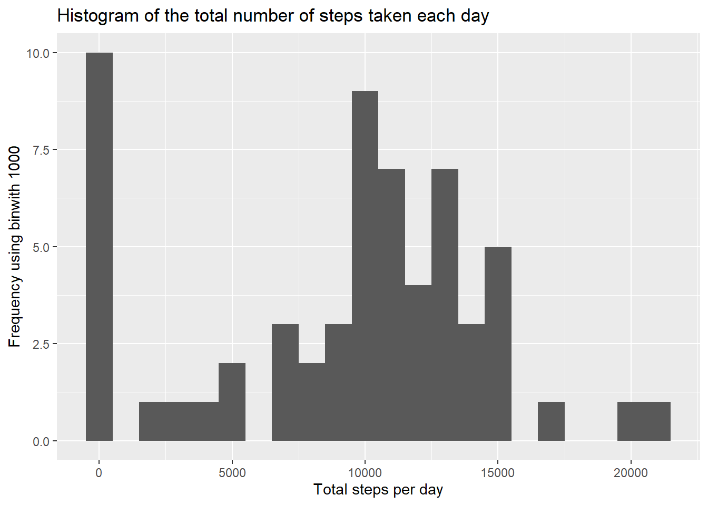
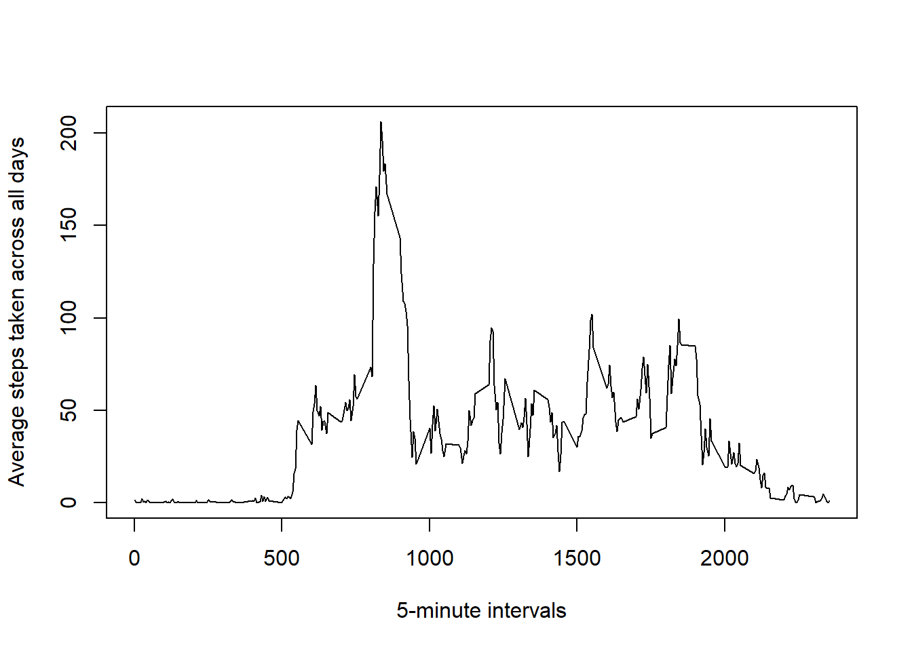
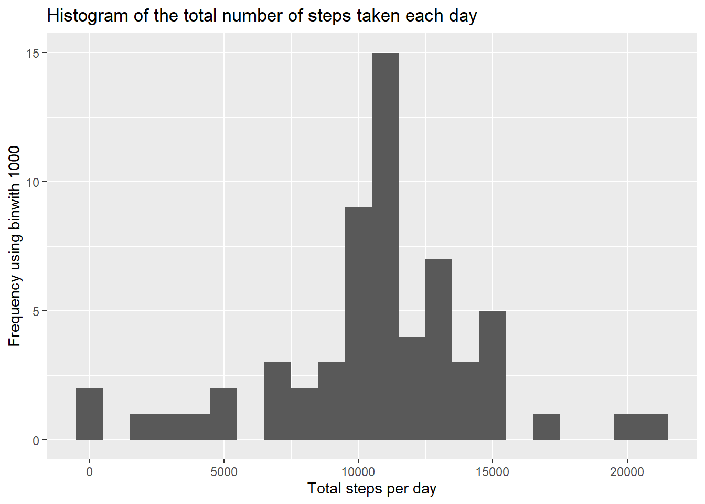
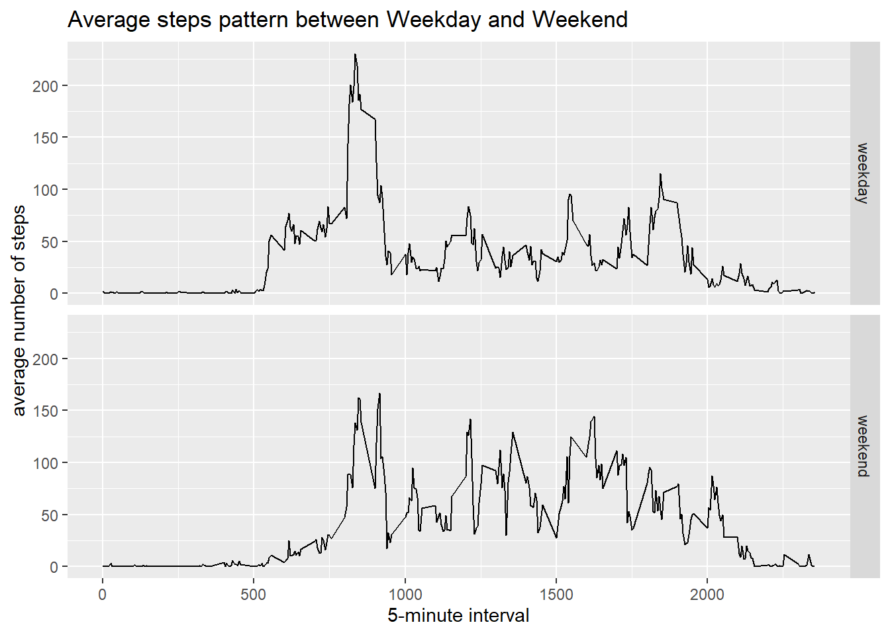

## Loading and preprocessing the data
Extract the data from zipfile

```r
unzip('activity.zip')
```
Load csv data to a data frame

```r
raw_data <- read.csv('activity.csv')
```

## What is mean total number of steps taken per day?
Convert the date column to Date format

```r
raw_data$date <- as.Date(raw_data$date)
```

Group the data frame by dates and compute mean

```r
library(dplyr)
library(ggplot2)
stepsbyDate <- raw_data %>% group_by(date) %>% 
    summarise(Total.Steps = sum(steps, na.rm = TRUE))
#hist(stepsbyDate$Total.Steps)
qplot(Total.Steps, data=stepsbyDate, na.rm=TRUE, binwidth=1000,
      xlab='Total steps per day', ylab='Frequency using binwith 1000',
      main = 'Histogram of the total number of steps taken each day')
```



```r
mean <- as.integer(mean(stepsbyDate$Total.Steps))
median <- median(stepsbyDate$Total.Steps)
```
**Summary of Total number of steps taken per day**  
Mean = 9354  
Median = 10395

## What is the average daily activity pattern?
Time series plot of average number of steps taken

```r
stepsbyDay <- raw_data %>% group_by(interval) %>% 
    summarize(Avg.Steps.Across.Days = mean(steps, na.rm=TRUE))
plot(stepsbyDay$interval, stepsbyDay$Avg.Steps.Across.Days, type='l'
     ,xlab = "5-minute intervals",ylab = "Average steps taken across all days")
```



```r
maxsteps <- stepsbyDay$interval[which(stepsbyDay$Avg.Steps.Across.Days 
                                      == max(stepsbyDay$Avg.Steps.Across.Days))]
```

Maximum number of steps taken by the person on interval 835.

## Imputing missing values

```r
missing <- sum(is.na(raw_data$steps))
```

Total number of missing values 2304.  


Replace missing values with the values from average steps taken across 
days over each time interval. Create new data set imputed_data

```r
# Replace missing values from the averages calculated in previous section
impute <- function(steps, interval){
    filled <- NA
    if(is.na(steps))
        filled <- stepsbyDay[stepsbyDay$interval == interval
                             ,'Avg.Steps.Across.Days']
    else
        filled <- steps
    
    return (as.integer(filled))
}

imputed_data <- raw_data

imputed_data$steps <- mapply(impute, imputed_data$steps, 
                                imputed_data$interval)
```

Histogram of number of steps

```r
imputedstepsbyDate <- imputed_data %>% group_by(date) %>% 
    summarise(Total.Steps = sum(steps, na.rm = TRUE))
#hist(imputedstepsbyDate$Total.Steps)
qplot(Total.Steps, data=imputedstepsbyDate, na.rm=TRUE, binwidth=1000,
      xlab='Total steps per day', ylab='Frequency using binwith 1000',
      main = 'Histogram of the total number of steps taken each day')
```



```r
impute_mean <- as.integer(mean(imputedstepsbyDate$Total.Steps))
impute_median <- median(imputedstepsbyDate$Total.Steps)
```
**Summary of Total number of steps taken per day after imputation**  
Mean = 10749  
Median = 10641

The values are different from the first part of assignment (Mean=9354
, Median=10395)
Imputing the data have increased mean and median values of total steps taken per day.


## Are there differences in activity patterns between weekdays and weekends?

```r
imputed_data <- imputed_data %>% mutate(DayType=as.factor(
    ifelse((weekdays(date) == "Saturday" | weekdays(date) == "Sunday"), 
           "weekend", "weekday")))
imputedstepsbyDay <- imputed_data %>% group_by(interval,DayType) %>% 
    summarize(Avg.Steps.Across.Days = mean(steps, na.rm=TRUE))
qplot(data=imputedstepsbyDay, x=interval, y=Avg.Steps.Across.Days, geom='line', 
      facets = DayType~.,xlab="5-minute interval",ylab="average number of steps"
      ,main="Average steps pattern between Weekday and Weekend")
```


**From the plots it is clear the person walks more on the weekend.**
